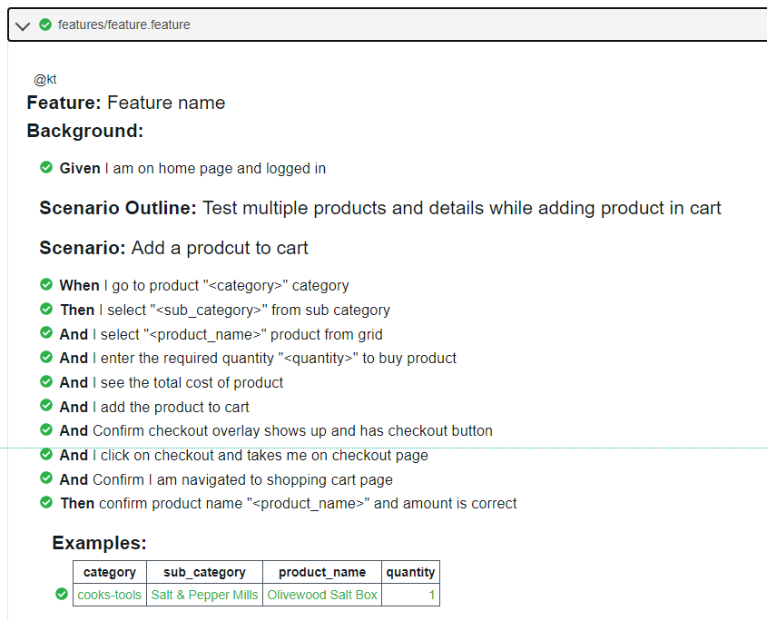
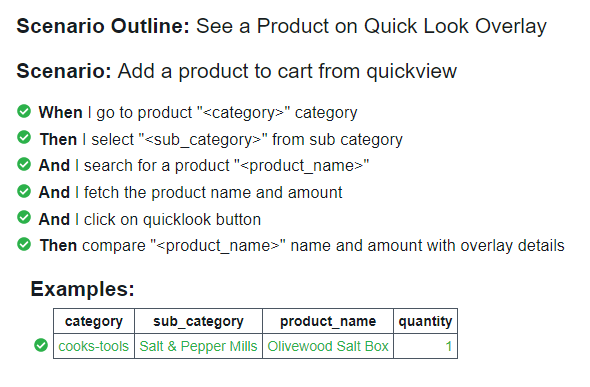

# williams-sonoma
## Introduction
This is to test https://www.williams-sonoma.com/ using page object model.
###### Scenario 01:
- Product page shows "Add to cart” button
- When click on "Add to cart” button, add to cart overlay appears
- Checkout button is on the add to cart overlay
- When click on "Checkout" button then shopping cart page is shown
- The product you added to cart should be on shopping cart page
###### Scenario 02:
- Search field takes to the results page
- Below the product's image display the quick look link
- Click the quick look link show the product overlay
- The product clicked should have the same name and price as the product in the overlay

## Browser
Provide ChromeDriver path in ```home_page.rb```
## Install Gems
##### Option 01
Run command ```bundle install``` to install required gems or install them individually as mentioned in below steps.
##### Option 02
Install Manually 
## cucumber 
May require to initialize use command ```cucumber --init``` on terminal 

## Watir - Selenium Wrapper
Run command on cmd ```gem install watir```

## Watir-Webdriver
Run command on cmd ```gem install watir-webdriver```

## Running Test
Run command on Terminal ```cucumber -t @kt```

## Built With
1️⃣  Ruby
2️⃣  Watir (Selenium Wrapper)
3️⃣  Cucumber

## Scenario - 01 Results



## Scenario - 02 Results


## Author
Kunaal Thanik
